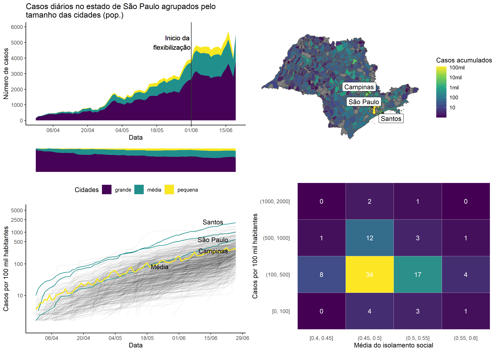

```{r global_options, include=FALSE}
knitr::opts_chunk$set(warning=FALSE, message=FALSE)
```


```{r, include = FALSE}
#necessary packages
library(ggplot2)
library(sf)
library(geobr)
library(dplyr)
library(ggrepel)
library(grid)
library(gridExtra)
```

```{r, results = FALSE}
#handling the dataframe
data_original <- read.csv("dados_covid_sp.csv", sep = ";", encoding = "UTF-8")
data_sp <- data_original %>%
  select(nome_munic, dia, mes, datahora, casos, casos_novos, casos_pc, casos_mm7d, 
         obitos, obitos_novos, obitos_pc, obitos_mm7d, letalidade, pop, pop_60, semana_epidem) %>%
  mutate(datahora = as.Date(datahora, "%d/%m/%Y")) %>%
  mutate(tamanho_cidade = ifelse(pop > 500000, "grande", ifelse(pop > 100000, "média", "pequena")))

data_sp.plot1 <- data_sp %>% group_by(tamanho_cidade, datahora) %>%
  summarise(casos_novos = sum(casos_novos), casos_mm7d = sum(casos_mm7d))


#setting plot information
title <- "Casos diários no estado de São Paulo agrupados pelo\ntamanho das cidades (pop.)"
x_lab <- "Data"
x_lim <- c(as.Date("2020-03-30"),max(unique(data_sp.plot1$datahora)) - 7)
y_lab <- "Número de casos"
y_ticks <- seq(0, 5000, 1000)
color_title <- "Cidades"
color_lab <- c("pequena", "média", "grande")
color_val <- c("#450256","#21908d", "#f9e721")


plot1 <- ggplot(data_sp.plot1) +
  geom_area(aes(x = datahora, y = casos_mm7d, fill = tamanho_cidade), position = position_stack(reverse = TRUE)) +
  scale_x_date(x_lab, date_breaks = "2 week", date_labels = "%d/%m", limits = x_lim) +
  scale_y_continuous(y_lab, breaks = y_ticks, limits = c(0, 7000)) +
  scale_colour_manual(color_title, values = color_val, aesthetics = "fill") +
  ggtitle(title) +
  theme(legend.position = "bottom")

data_sp.plot3 <- data_sp.plot1 %>% 
  mutate(casos_mm7d = ifelse(casos_mm7d < 0, 0, casos_mm7d)) %>%
  group_by(datahora) %>% 
  mutate(porcentagem = casos_mm7d/sum(casos_mm7d))
data_sp.plot3[is.na(data_sp.plot3$porcentagem), "porcentagem"] <- 0
data_sp.plot3[data_sp.plot3$porcentagem > 1, "porcentagem"] <- 1
data_sp.plot3[data_sp.plot3$porcentagem < 0, "porcentagem"] <- 0

plot3 <- ggplot(data_sp.plot3) +
  geom_area(aes(x = datahora, y = porcentagem, fill = tamanho_cidade), 
            position = position_stack(reverse =  TRUE)) +
  scale_x_date(limits = x_lim) +
  scale_y_continuous(limits = c(-0, 1)) +
  scale_colour_manual(values = color_val, aesthetics = "fill") +
  theme(axis.line=element_blank(),
      axis.text.x=element_blank(),
      axis.text.y=element_blank(),
      axis.ticks=element_blank(),
      axis.title.x=element_blank(),
      axis.title.y=element_blank(),
      legend.position="none",
      panel.background=element_blank(),
      panel.border=element_blank(),
      panel.grid.major=element_blank(),
      panel.grid.minor=element_blank(),
      plot.background=element_blank())

mun <- read_municipality(code_muni = "SP", year = 2018, simplified = TRUE)
data_sp.plot2 <- left_join(mun, 
                           data_sp %>% filter(datahora == max(data_sp$datahora)), 
                           by = c("name_muni" = "nome_munic"))
#setting plot information
fill_title <- "Casos acumulados"
fill_breaks <- c(10, 100, 1000, 10000, 100000)
fill_labs <- c("10", "100", "1mil", "10mil", "100mil")
cidades <- c("São Paulo", "Campinas", "Santos")

plot2 <- ggplot(data_sp.plot2) +
  geom_sf(aes(fill = casos)) +
  scale_fill_continuous(fill_title, type = "viridis", trans = "pseudo_log",
                        breaks = fill_breaks, labels =  fill_labs) +
  geom_label_repel(data = data_sp.plot2 %>% 
                     filter(name_muni %in% cidades), 
                   aes(label = name_muni, geometry = geom),
                       stat = "sf_coordinates",
                       min.segment.length = 0) +
  theme(axis.line = element_blank(),
        axis.ticks = element_blank(),
        axis.text = element_blank(),
        axis.title = element_blank(),
        panel.background = element_blank(),
        panel.grid = element_blank())
  
g <- arrangeGrob(plot1, plot2, nrow=2) #generates g
ggsave(file="test.png", plot = g, width = 210, height = 297, unit = "mm") #saves g


plotGrob <- rbind(ggplotGrob(plot1), ggplotGrob(plot3))
panels <- plotGrob$layout$t[grep("panel", plotGrob$layout$name)]
plotGrob$heights[panels] <- unit(c(0.85, 0.15), "null")
grid <- grid.arrange(plotGrob, plot2, heights = c(0.6, 0.4))
ggsave("plot.png", plot = grid, width = 210, height = 297, units = "mm")

```
</img>

